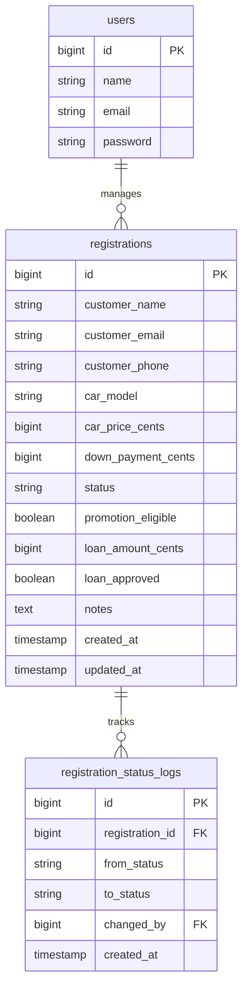
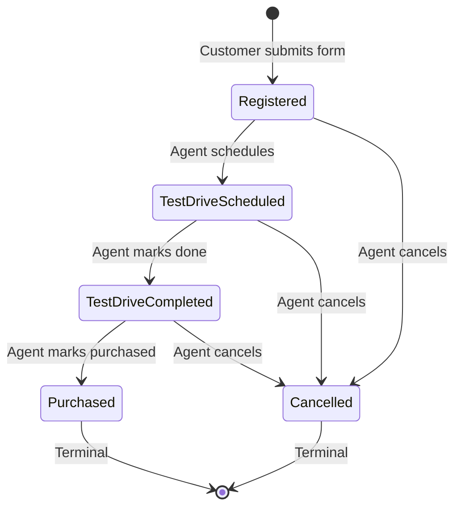
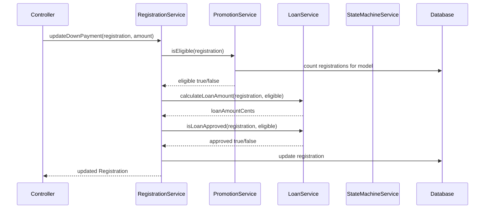

# CapBay Auto — Test Drive Registration System Architecture

## Overview

A Laravel 13 + Blade + Tailwind CSS system for CapBay Auto Sdn. Bhd. that allows:
- **Customers** to register for test drives via a public form
- **Sales agents** (authenticated users) to manage registrations, check promotion eligibility, update down payments, and view loan amounts

---

## 1. Database Schema Design

### Tables

#### `users` (existing Breeze table — no changes needed)
| Column | Type | Notes |
|--------|------|-------|
| id | bigint AI PK | |
| name | varchar(255) | |
| email | varchar(255) | unique |
| email_verified_at | timestamp nullable | |
| password | varchar(255) | |
| remember_token | varchar(100) nullable | |
| created_at | timestamp | |
| updated_at | timestamp | |

#### `registrations` (new)
| Column | Type | Notes |
|--------|------|-------|
| id | bigint AI PK | |
| customer_name | varchar(255) | |
| customer_email | varchar(255) | |
| customer_phone | varchar(20) | |
| car_model | varchar(100) | e.g. "CapBay Vroom" |
| car_price_cents | bigint | integer cents, e.g. 20000000 for RM 200,000 |
| down_payment_cents | bigint | integer cents, default 0 |
| status | enum / varchar(20) | mapped to `RegistrationStatus` enum |
| promotion_eligible | boolean nullable | computed by service, null until checked |
| loan_amount_cents | bigint nullable | computed by service, null until checked |
| loan_approved | boolean nullable | null until checked |
| notes | text nullable | agent notes |
| created_at | timestamp | |
| updated_at | timestamp | |

**Indexes:**
- `INDEX(customer_email)` — for customer lookup
- `INDEX(status)` — for filtering by status
- `INDEX(created_at)` — for ordering/sorting the list
- `INDEX(car_model, status, created_at)` — composite for promotion eligibility queries

#### `registration_status_logs` (new — state transition audit trail)
| Column | Type | Notes |
|--------|------|-------|
| id | bigint AI PK | |
| registration_id | bigint FK | |
| from_status | varchar(20) nullable | null for initial creation |
| to_status | varchar(20) | |
| changed_by | bigint FK nullable | references users.id (null if customer action) |
| created_at | timestamp | |

**Indexes:**
- `INDEX(registration_id)` — for loading history per registration

### ER Diagram



### Why Integer Cents for Money

- **Precision**: Integers avoid floating-point rounding errors (0.1 + 0.2 != 0.3 in float)
- **Clarity**: `20000000` cents = RM 200,000.00 is unambiguous
- **Performance**: Integer arithmetic is faster than DECIMAL in MySQL
- **Tradeoff**: Requires conversion for display (divide by 100). A helper class handles this.

---

## 2. Models and Relationships

### [`app/Models/User.php`](app/Models/User.php) (existing — extend with relationship)
```php
// Add:
public function registrations(): HasMany
{
    return $this->hasMany(Registration::class, 'assigned_to');
}
```

### [`app/Models/Registration.php`](app/Models/Registration.php) (new)
```php
class Registration extends Model
{
    protected $fillable = [
        'customer_name', 'customer_email', 'customer_phone',
        'car_model', 'car_price_cents', 'down_payment_cents',
        'status', 'promotion_eligible', 'loan_amount_cents',
        'loan_approved', 'notes',
    ];

    protected function casts(): array
    {
        return [
            'status' => RegistrationStatus::class,       // Enum cast
            'promotion_eligible' => 'boolean',
            'loan_approved' => 'boolean',
            'car_price_cents' => 'integer',
            'down_payment_cents' => 'integer',
            'loan_amount_cents' => 'integer',
        ];
    }

    public function statusLogs(): HasMany
    {
        return $this->hasMany(RegistrationStatusLog::class);
    }
}
```

### [`app/Models/RegistrationStatusLog.php`](app/Models/RegistrationStatusLog.php) (new)
```php
class RegistrationStatusLog extends Model
{
    protected $fillable = ['registration_id', 'from_status', 'to_status', 'changed_by'];

    protected function casts(): array
    {
        return [
            'from_status' => RegistrationStatus::class,
            'to_status' => RegistrationStatus::class,
        ];
    }

    public function registration(): BelongsTo
    {
        return $this->belongsTo(Registration::class);
    }

    public function changedBy(): BelongsTo
    {
        return $this->belongsTo(User::class, 'changed_by');
    }
}
```

---

## 3. Enum Structure

### [`app/Enums/RegistrationStatus.php`](app/Enums/RegistrationStatus.php)

```php
<?php

namespace App\Enums;

enum RegistrationStatus: string
{
    case Registered = 'registered';
    case TestDriveScheduled = 'test_drive_scheduled';
    case TestDriveCompleted = 'test_drive_completed';
    case Purchased = 'purchased';
    case Cancelled = 'cancelled';

    /**
     * Returns the list of valid next states from the current state.
     */
    public function allowedTransitions(): array
    {
        return match ($this) {
            self::Registered => [self::TestDriveScheduled, self::Cancelled],
            self::TestDriveScheduled => [self::TestDriveCompleted, self::Cancelled],
            self::TestDriveCompleted => [self::Purchased, self::Cancelled],
            self::Purchased => [],          // Terminal state
            self::Cancelled => [],          // Terminal state
        };
    }

    /**
     * Returns true if transitioning to $next is valid.
     */
    public function canTransitionTo(self $next): bool
    {
        return in_array($next, $this->allowedTransitions(), true);
    }
}
```

### State Machine Diagram



**Design Decision**: `Cancelled` is a terminal state. A cancelled registration cannot be re-activated. This keeps the state machine simple and auditable. If a customer re-engages, a new registration is created.

---

## 4. Service Layer Design

### [`app/Services/RegistrationService.php`](app/Services/RegistrationService.php)

Central service orchestrating all registration operations.

```php
class RegistrationService
{
    public function __construct(
        private PromotionService $promotionService,
        private LoanService $loanService,
        private StateMachineService $stateMachine,
    ) {}

    // Creates a new registration from customer form data
    public function createRegistration(array $data): Registration

    // Lists registrations with pagination and optional filters
    public function listRegistrations(array $filters = []): LengthAwarePaginator

    // Looks up a single registration by ID
    public function findRegistration(int $id): Registration

    // Transitions a registration to a new state
    public function transitionStatus(Registration $registration, RegistrationStatus $newStatus, ?User $user): Registration

    // Updates down payment and re-evaluates promotion + loan
    public function updateDownPayment(Registration $registration, int $downPaymentCents): Registration

    // Marks purchase status and re-evaluates promotion
    public function markPurchased(Registration $registration): Registration

    // Checks promotion eligibility (delegates to PromotionService)
    public function checkPromotionEligibility(Registration $registration): array

    // Calculates loan amount (delegates to LoanService)
    public function calculateLoan(Registration $registration): array
}
```

### [`app/Services/PromotionService.php`](app/Services/PromotionService.php)

Handles the "CapBay Vroom 15% discount for first 10 customers" logic.

```php
class PromotionService
{
    private const PROMOTION_CAR_MODEL = 'CapBay Vroom';
    private const PROMOTION_DISCOUNT_PERCENT = 15;
    private const PROMOTION_MAX_SLOTS = 10;
    private const MIN_DOWN_PAYMENT_PERCENT = 10;

    /**
     * Check if a registration is eligible for the promotion.
     *
     * Rules:
     * 1. Car model must be "CapBay Vroom"
     * 2. Customer must be among the first 10 who registered for this model
     * 3. Customer must have paid >= 10% down payment
     * 4. Customer must have loan approved
     *
     * KEY DECISION — Cancellation handling:
     * If a customer who was in the first 10 cancels, their slot is NOT freed.
     * Customer C (11th registrant) does NOT become eligible.
     *
     * Reasoning: The promotion says "first 10 customers" — this refers to
     * chronological registration order. A slot is consumed when a customer
     * registers, not when they purchase. This is simpler to implement,
     * easier to explain to customers, and avoids complex recalculation
     * every time a registration is cancelled.
     */
    public function isEligible(Registration $registration): bool

    /**
     * Get the registration's position in the queue for this car model.
     * Only counts registrations that were created (not cancelled retroactively).
     */
    public function getQueuePosition(Registration $registration): int

    /**
     * Count how many promotion slots are still available.
     */
    public function getRemainingSlots(): int
}
```

### [`app/Services/LoanService.php`](app/Services/LoanService.php)

Handles loan amount calculation.

```php
class LoanService
{
    /**
     * Calculate the loan amount for a registration.
     *
     * Formula: loan_amount = car_price - down_payment
     * If promotion applies: loan_amount = (car_price * 0.85) - down_payment
     *
     * All calculations in integer cents to avoid floating point errors.
     */
    public function calculateLoanAmount(Registration $registration, bool $promotionApplies): int

    /**
     * Determine if the loan is approved based on:
     * - Down payment >= minimum required
     * - (In real system this would integrate with a bank API)
     * For now: loan is "approved" if down payment >= 10% of car price
     */
    public function isLoanApproved(Registration $registration, bool $promotionApplies): bool
}
```

### [`app/Services/StateMachineService.php`](app/Services/StateMachineService.php)

Encapsulates all state transition logic.

```php
class StateMachineService
{
    /**
     * Transition a registration to a new status.
     *
     * @throws InvalidTransitionException if the transition is not allowed
     */
    public function transition(Registration $registration, RegistrationStatus $newStatus, ?User $changedBy): Registration

    /**
     * Get all allowed next states for a registration.
     */
    public function getAllowedTransitions(Registration $registration): array

    /**
     * Log the transition to registration_status_logs.
     */
    private function logTransition(Registration $registration, ?RegistrationStatus $from, RegistrationStatus $to, ?User $changedBy): void
}
```

### Service Interaction Flow



---

## 5. Promotion Eligibility Logic (Detailed)

### Algorithm in [`app/Services/PromotionService.php`](app/Services/PromotionService.php)

```
isEligible(registration):
    1. IF registration.car_model != 'CapBay Vroom' → return false
    2. IF registration.down_payment_cents < car_price_cents * 10% → return false
    3. IF registration.loan_approved != true → return false
    4. Count registrations for 'CapBay Vroom' where:
       - created_at <= registration.created_at
       - status != 'cancelled'  (wait — this is the key decision point)
    5. IF position > 10 → return false
    6. return true
```

### The Cancellation Decision

**Decision: Cancelled registrations do NOT free up promotion slots.**

- **Customer A** (1st) → slot 1 consumed
- **Customer B** (2nd, cancelled) → slot 2 consumed, NOT freed
- **Customer C** (11th) → slot 11, NOT eligible

**Why?**
1. **Simplicity**: No need to recalculate eligibility when a cancellation happens
2. **Fairness**: The promotion says "first 10 customers" — this is determined at registration time, not purchase time
3. **Predictability**: Sales agents can immediately tell a customer their eligibility without worrying about future cancellations
4. **Auditability**: The promotion slot assignment is immutable once created

**Alternative considered**: Freeing slots on cancellation. This would make Customer C eligible if Customer B cancels. Rejected because it creates a moving target — eligibility could change days later when someone cancels, which is confusing for customers and agents.

---

## 6. Loan Calculation Logic

### Formula

```
carPrice = registration.car_price_cents          // e.g. 20,000,000 (RM 200,000)
downPayment = registration.down_payment_cents    // e.g. 2,000,000 (RM 20,000)
promotionApplies = PromotionService.isEligible()

effectivePrice = promotionApplies
    ? carPrice - (carPrice * 15 / 100)   // 15% discount
    : carPrice

loanAmount = effectivePrice - downPayment
```

### Example Scenarios

| Customer | Car Price | Down Payment | Promotion | Effective Price | Loan Amount |
|----------|-----------|-------------|-----------|----------------|-------------|
| A (1st, 20%) | RM 200,000 | RM 40,000 | Yes | RM 170,000 | RM 130,000 |
| B (2nd, cancelled) | RM 200,000 | RM 0 | N/A | N/A | N/A |
| C (11th, 10%) | RM 200,000 | RM 20,000 | No | RM 200,000 | RM 180,000 |

### Loan Approval Logic

For this system, loan approval is determined by:
- `down_payment_cents >= car_price_cents * 10 / 100` (at least 10% down payment)
- In production, this would integrate with a bank API or credit check system

---

## 7. State Transition Design

### Valid Transitions

| From → To | Allowed? | Who Can Trigger |
|-----------|----------|-----------------|
| Registered → Test Drive Scheduled | ✅ | Agent |
| Registered → Cancelled | ✅ | Agent |
| Test Drive Scheduled → Test Drive Completed | ✅ | Agent |
| Test Drive Scheduled → Cancelled | ✅ | Agent |
| Test Drive Completed → Purchased | ✅ | Agent |
| Test Drive Completed → Cancelled | ✅ | Agent |
| Purchased → anything | ❌ | Terminal state |
| Cancelled → anything | ❌ | Terminal state |

### Invalid Transition Handling

When an invalid transition is attempted, [`StateMachineService`](app/Services/StateMachineService.php) throws an [`App\Exceptions\InvalidTransitionException`](app/Exceptions/InvalidTransitionException.php):

```php
class InvalidTransitionException extends \RuntimeException
{
    public function __construct(
        RegistrationStatus $from,
        RegistrationStatus $to,
    ) {
        parent::__construct(
            "Cannot transition from {$from->value} to {$to->value}"
        );
    }
}
```

The controller catches this and returns a flash error message to the agent.

### Audit Trail

Every state transition is recorded in [`registration_status_logs`](database/migrations/xxxx_xx_xx_create_registration_status_logs_table.php) with:
- Previous status (`from_status`, nullable for initial creation)
- New status (`to_status`)
- Who changed it (`changed_by`, references users.id)
- Timestamp (`created_at`)

This provides a complete audit trail for compliance and dispute resolution.

---

## 8. Scalability Approach for 50k Registrations

### Database Level
1. **Indexes** on frequently queried columns: `status`, `customer_email`, `created_at`, composite `(car_model, status, created_at)`
2. **Pagination** (not offset-based for deep pages — use cursor pagination via Laravel's `cursorPaginate()` for the registration list)
3. **Query optimization**: The promotion eligibility query counts registrations for a specific model — this is an indexed COUNT query that performs well even at 50k rows

### Application Level
1. **Eager loading**: Always eager-load relationships to avoid N+1 queries
2. **Caching**: Cache the promotion slot count (remaining slots) with a short TTL, invalidated when a new registration is created
3. **Chunking**: For any batch operations, use `Registration::chunk()` to avoid memory issues

### Performance Projection
- 50k rows in `registrations` table is small for MySQL
- Indexed queries return in < 10ms
- Paginated list pages load in < 100ms
- Promotion eligibility check is a single COUNT query — < 5ms
- No need for read replicas, caching layers, or queue workers at this scale

### If Scale Grows Beyond 50k
- Add Redis caching for promotion slot counts
- Consider read replicas for reporting queries
- Add search indexing (Elasticsearch) if full-text search on customer names is needed

---

## 9. Suggested Routes

### [`routes/web.php`](routes/web.php)

```php
<?php

use App\Http\Controllers\RegistrationController;
use App\Http\Controllers\CustomerRegistrationController;
use Illuminate\Support\Facades\Route;

// ===== Public Routes (no auth) =====
Route::get('/test-drive', [CustomerRegistrationController::class, 'create'])
    ->name('test-drive.create');
Route::post('/test-drive', [CustomerRegistrationController::class, 'store'])
    ->name('test-drive.store');
Route::get('/test-drive/thank-you', [CustomerRegistrationController::class, 'thankYou'])
    ->name('test-drive.thank-you');

// ===== Authenticated Agent Routes =====
Route::middleware(['auth', 'verified'])->prefix('agent')->name('agent.')->group(function () {
    // Registration list
    Route::get('/registrations', [RegistrationController::class, 'index'])
        ->name('registrations.index');

    // Single registration detail
    Route::get('/registrations/{registration}', [RegistrationController::class, 'show'])
        ->name('registrations.show');

    // State transitions
    Route::patch('/registrations/{registration}/status', [RegistrationController::class, 'updateStatus'])
        ->name('registrations.update-status');

    // Down payment update
    Route::patch('/registrations/{registration}/down-payment', [RegistrationController::class, 'updateDownPayment'])
        ->name('registrations.update-down-payment');

    // Promotion eligibility check
    Route::post('/registrations/{registration}/check-promotion', [RegistrationController::class, 'checkPromotion'])
        ->name('registrations.check-promotion');

    // Loan calculation
    Route::post('/registrations/{registration}/calculate-loan', [RegistrationController::class, 'calculateLoan'])
        ->name('registrations.calculate-loan');
});
```

### Route Summary

| Method | URI | Name | Purpose |
|--------|-----|------|---------|
| GET | `/test-drive` | `test-drive.create` | Public registration form |
| POST | `/test-drive` | `test-drive.store` | Submit registration |
| GET | `/test-drive/thank-you` | `test-drive.thank-you` | Success page |
| GET | `/agent/registrations` | `agent.registrations.index` | List all registrations |
| GET | `/agent/registrations/{id}` | `agent.registrations.show` | View registration detail |
| PATCH | `/agent/registrations/{id}/status` | `agent.registrations.update-status` | Change status |
| PATCH | `/agent/registrations/{id}/down-payment` | `agent.registrations.update-down-payment` | Update down payment |
| POST | `/agent/registrations/{id}/check-promotion` | `agent.registrations.check-promotion` | Check eligibility |
| POST | `/agent/registrations/{id}/calculate-loan` | `agent.registrations.calculate-loan` | Calculate loan |

---

## 10. Suggested Controllers

### [`app/Http/Controllers/CustomerRegistrationController.php`](app/Http/Controllers/CustomerRegistrationController.php)

Handles public-facing registration flow.

```php
class CustomerRegistrationController extends Controller
{
    public function __construct(private RegistrationService $registrationService) {}

    // Show the test drive registration form
    public function create(): View

    // Store a new registration
    public function store(StoreRegistrationRequest $request): RedirectResponse

    // Show thank-you page after successful registration
    public function thankYou(): View
}
```

### [`app/Http/Controllers/RegistrationController.php`](app/Http/Controllers/RegistrationController.php)

Handles agent-facing operations (requires auth).

```php
class RegistrationController extends Controller
{
    public function __construct(private RegistrationService $registrationService) {}

    // List all registrations with pagination and filters
    public function index(ListRegistrationRequest $request): View

    // Show a single registration detail
    public function show(Registration $registration): View

    // Update registration status (state transition)
    public function updateStatus(UpdateRegistrationStatusRequest $request, Registration $registration): RedirectResponse

    // Update down payment amount
    public function updateDownPayment(UpdateDownPaymentRequest $request, Registration $registration): RedirectResponse

    // Check promotion eligibility
    public function checkPromotion(Registration $registration): RedirectResponse

    // Calculate loan amount
    public function calculateLoan(Registration $registration): RedirectResponse
}
```

---

## 11. Suggested Form Requests

### [`app/Http/Requests/StoreRegistrationRequest.php`](app/Http/Requests/StoreRegistrationRequest.php)

Validates the public registration form.

```php
class StoreRegistrationRequest extends FormRequest
{
    public function authorize(): true  // Public form, always authorized

    public function rules(): array
    {
        return [
            'customer_name' => ['required', 'string', 'max:255'],
            'customer_email' => ['required', 'email', 'max:255'],
            'customer_phone' => ['required', 'string', 'max:20'],
            'car_model' => ['required', 'string', 'max:100'],
        ];
    }
}
```

### [`app/Http/Requests/ListRegistrationRequest.php`](app/Http/Requests/ListRegistrationRequest.php)

Validates filter/sort parameters for the registration list.

```php
class ListRegistrationRequest extends FormRequest
{
    public function authorize(): true  // Auth middleware handles this

    public function rules(): array
    {
        return [
            'status' => ['nullable', 'string', Rule::enum(RegistrationStatus::class)],
            'search' => ['nullable', 'string', 'max:255'],
            'per_page' => ['nullable', 'integer', 'min:10', 'max:100'],
        ];
    }
}
```

### [`app/Http/Requests/UpdateRegistrationStatusRequest.php`](app/Http/Requests/UpdateRegistrationStatusRequest.php)

Validates status transitions.

```php
class UpdateRegistrationStatusRequest extends FormRequest
{
    public function authorize(): true

    public function rules(): array
    {
        return [
            'status' => ['required', 'string', Rule::enum(RegistrationStatus::class)],
        ];
    }
}
```

### [`app/Http/Requests/UpdateDownPaymentRequest.php`](app/Http/Requests/UpdateDownPaymentRequest.php)

Validates down payment updates.

```php
class UpdateDownPaymentRequest extends FormRequest
{
    public function authorize(): true

    public function rules(): array
    {
        return [
            'down_payment_cents' => ['required', 'integer', 'min:0', 'max:999999999'],
        ];
    }
}
```

---

## 12. Suggested Pages/Views

### Public Pages

| View | Route | Description |
|------|-------|-------------|
| [`resources/views/test-drive/create.blade.php`](resources/views/test-drive/create.blade.php) | `test-drive.create` | Registration form with fields: name, email, phone, car model dropdown |
| [`resources/views/test-drive/thank-you.blade.php`](resources/views/test-drive/thank-you.blade.php) | `test-drive.thank-you` | Success message with reference number |

### Agent Pages (extends `layouts/app`)

| View | Route | Description |
|------|-------|-------------|
| [`resources/views/agent/registrations/index.blade.php`](resources/views/agent/registrations/index.blade.php) | `agent.registrations.index` | Paginated table with filters (status, search), sortable columns |
| [`resources/views/agent/registrations/show.blade.php`](resources/views/agent/registrations/show.blade.php) | `agent.registrations.show` | Detail view with: customer info, status badge, promotion status, loan info, down payment form, status transition buttons, audit log |

### Navigation Updates

Add to [`resources/views/layouts/navigation.blade.php`](resources/views/layouts/navigation.blade.php):
- "Registrations" nav link pointing to `agent.registrations.index`

### View Components to Create

| Component | Purpose |
|-----------|---------|
| `x-status-badge` | Displays registration status as a colored badge |
| `x-money` | Formats integer cents to RM display (e.g., 20000000 → RM 200,000.00) |
| `x-promotion-badge` | Shows "Eligible" / "Not Eligible" with styling |

---

## 13. Seeder Strategy

### [`database/seeders/DatabaseSeeder.php`](database/seeders/DatabaseSeeder.php)

```php
class DatabaseSeeder extends Seeder
{
    public function run(): void
    {
        $this->call([
            AdminUserSeeder::class,
            RegistrationSeeder::class,
        ]);
    }
}
```

### [`database/seeders/AdminUserSeeder.php`](database/seeders/AdminUserSeeder.php)

Creates a default sales agent account:
- Email: `agent@capbayauto.com`
- Password: `password`

### [`database/seeders/RegistrationSeeder.php`](database/seeders/RegistrationSeeder.php)

Populates 50,000+ registrations for performance testing:

```php
class RegistrationSeeder extends Seeder
{
    public function run(): void
    {
        // Create 50,000 registrations with varied states
        // Distribution:
        // - 40% Registered
        // - 20% Test Drive Scheduled
        // - 15% Test Drive Completed
        // - 10% Purchased
        // - 15% Cancelled

        // First 15 registrations are for "CapBay Vroom" to test promotion logic
        // Remaining are distributed across other models

        // Use Registration::factory()->count(50000)->create()
        // with sequence for varied statuses
    }
}
```

### [`database/factories/RegistrationFactory.php`](database/factories/RegistrationFactory.php)

```php
class RegistrationFactory extends Factory
{
    protected $model = Registration::class;

    public function definition(): array
    {
        return [
            'customer_name' => fake()->name(),
            'customer_email' => fake()->unique()->safeEmail(),
            'customer_phone' => fake()->phoneNumber(),
            'car_model' => fake()->randomElement(['CapBay Vroom', 'CapBay Sedan', 'CapBay SUV']),
            'car_price_cents' => fake()->randomElement([20000000, 15000000, 18000000]),
            'down_payment_cents' => 0,
            'status' => RegistrationStatus::Registered,
            'promotion_eligible' => null,
            'loan_amount_cents' => null,
            'loan_approved' => null,
            'notes' => null,
        ];
    }

    // State methods for specific scenarios
    public function capbayVroom(): static
    public function withDownPayment(int $percent): static
    public function purchased(): static
    public function cancelled(): static
}
```

---

## 14. Testing Strategy

### Test Structure (PestPHP)

```
tests/
├── Feature/
│   ├── Auth/              (existing Breeze tests)
│   ├── CustomerRegistrationTest.php
│   ├── AgentRegistrationManagementTest.php
│   ├── PromotionEligibilityTest.php
│   ├── LoanCalculationTest.php
│   ├── StateTransitionTest.php
│   └── RegistrationListScalingTest.php
├── Unit/
│   ├── Services/
│   │   ├── PromotionServiceTest.php
│   │   ├── LoanServiceTest.php
│   │   └── StateMachineServiceTest.php
│   └── Enums/
│       └── RegistrationStatusTest.php
└── TestCase.php
```

### Test Cases

#### [`tests/Feature/CustomerRegistrationTest.php`](tests/Feature/CustomerRegistrationTest.php)
- Customer can view the registration form
- Customer can submit valid registration data
- Customer cannot submit with missing required fields
- Customer is redirected to thank-you page after successful registration
- Duplicate email is allowed (same person can register for multiple test drives)

#### [`tests/Feature/AgentRegistrationManagementTest.php`](tests/Feature/AgentRegistrationManagementTest.php)
- Unauthenticated users cannot access agent routes
- Agent can view paginated registration list
- Agent can view registration detail
- Agent can update down payment
- Agent can check promotion eligibility
- Agent can calculate loan amount

#### [`tests/Feature/PromotionEligibilityTest.php`](tests/Feature/PromotionEligibilityTest.php)
- Customer A (1st, 20% down) is eligible
- Customer B (2nd, cancelled) is not eligible
- Customer C (11th, 10% down) is not eligible
- Customer with < 10% down payment is not eligible
- Customer with non-promotion car model is not eligible
- Cancelled registrations do NOT free up promotion slots

#### [`tests/Feature/StateTransitionTest.php`](tests/Feature/StateTransitionTest.php)
- Valid transitions succeed
- Invalid transitions throw exception
- Cannot transition from Purchased
- Cannot transition from Cancelled
- Status log is created on each transition
- Status log records the user who made the change

#### [`tests/Feature/RegistrationListScalingTest.php`](tests/Feature/RegistrationListScalingTest.php)
- Registration list loads within acceptable time with 50k records
- Pagination works correctly
- Filtering by status works
- Search by customer name/email works

#### [`tests/Unit/Services/PromotionServiceTest.php`](tests/Unit/Services/PromotionServiceTest.php)
- Pure logic tests without database (using mocked models)
- Queue position calculation
- Remaining slots calculation
- Edge cases: exactly 10 registrations, 0 registrations

#### [`tests/Unit/Services/LoanServiceTest.php`](tests/Unit/Services/LoanServiceTest.php)
- Loan amount calculation with promotion
- Loan amount calculation without promotion
- Loan approval threshold (10% down payment)
- Integer precision: no floating point errors

#### [`tests/Unit/Services/StateMachineServiceTest.php`](tests/Unit/Services/StateMachineServiceTest.php)
- All valid transitions listed
- All invalid transitions rejected
- Terminal states cannot transition

#### [`tests/Unit/Enums/RegistrationStatusTest.php`](tests/Unit/Enums/RegistrationStatusTest.php)
- All statuses have correct string values
- Allowed transitions are correct for each status
- `canTransitionTo()` returns correct boolean

---

## 15. Folder/Project Structure

```
capbay-auto/
├── app/
│   ├── Enums/
│   │   └── RegistrationStatus.php
│   ├── Exceptions/
│   │   └── InvalidTransitionException.php
│   ├── Http/
│   │   ├── Controllers/
│   │   │   ├── Auth/              (existing)
│   │   │   ├── CustomerRegistrationController.php
│   │   │   ├── ProfileController.php  (existing)
│   │   │   └── RegistrationController.php
│   │   └── Requests/
│   │       ├── Auth/              (existing)
│   │       ├── ListRegistrationRequest.php
│   │       ├── StoreRegistrationRequest.php
│   │       ├── UpdateDownPaymentRequest.php
│   │       └── UpdateRegistrationStatusRequest.php
│   ├── Models/
│   │   ├── Registration.php
│   │   ├── RegistrationStatusLog.php
│   │   └── User.php               (existing, extend)
│   ├── Providers/
│   │   └── AppServiceProvider.php  (existing, extend)
│   └── Services/
│       ├── LoanService.php
│       ├── PromotionService.php
│       ├── RegistrationService.php
│       └── StateMachineService.php
├── database/
│   ├── factories/
│   │   └── RegistrationFactory.php
│   ├── migrations/
│   │   ├── 0001_01_01_000000_create_users_table.php  (existing)
│   │   ├── 0001_01_01_000001_create_cache_table.php  (existing)
│   │   ├── 0001_01_01_000002_create_jobs_table.php   (existing)
│   │   ├── xxxx_xx_xx_create_registrations_table.php
│   │   └── xxxx_xx_xx_create_registration_status_logs_table.php
│   └── seeders/
│       ├── AdminUserSeeder.php
│       ├── DatabaseSeeder.php     (existing, extend)
│       └── RegistrationSeeder.php
├── resources/
│   └── views/
│       ├── agent/
│       │   └── registrations/
│       │       ├── index.blade.php
│       │       └── show.blade.php
│       ├── auth/                  (existing)
│       ├── components/            (existing + new)
│       │   ├── money.blade.php
│       │   ├── promotion-badge.blade.php
│       │   └── status-badge.blade.php
│       ├── layouts/               (existing)
│       ├── profile/               (existing)
│       └── test-drive/
│           ├── create.blade.php
│           └── thank-you.blade.php
